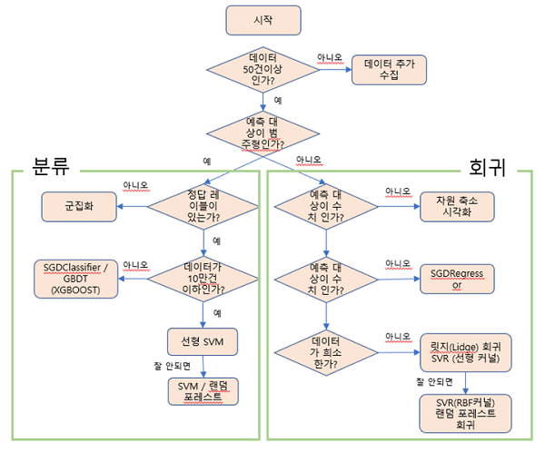
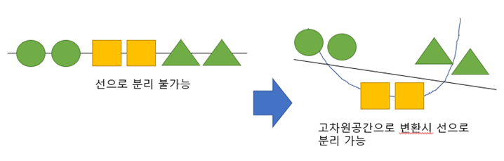
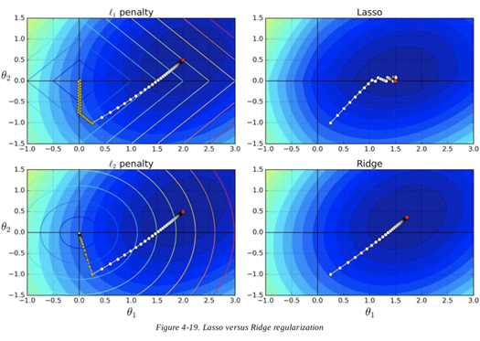
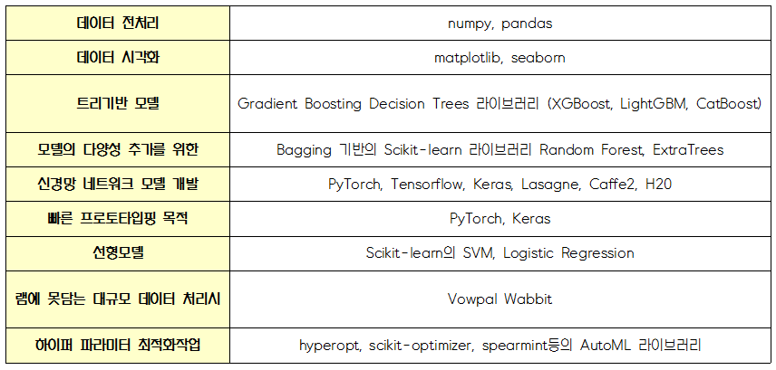

# DataAnalysis
데이터 분석 / Machine Learning / 모델링 등 정리

## ■ 머신러닝 알고리즘 선택 방법
- 분류 : 정답이 비연속적인 클래스(카테고리)이며, 정답과 입력 데이터의 조합을 학습하여 새로운 데이터의 클래스를 예측
- 회귀 : 정답이 수치인 경우, 정답과 입력 데이터의 조합을 학습하여 새로운 데이터에서 연속하는 (continuous)값을 예측함.
- 군집화 : 어떤 기준에 따라 데이터를 그룹으로 묶음
- 차원축소 : 시각화 또는 계산량 절감을 목적으로 고차원 데이터를 저차원 공간에 매핑
- 추천 : 사용자가 선호할 품목, 혹은 열람한 것과 비슷한 품목을 제시
- 이상탐지 : 수상한 접근 등 평소와 다른 행동을 검출
- 고빈도 패턴 마이닝 : 데이터 안에서 발생 빈도가 높은 패턴을 추출

### ■ 분류 - 유사한 의미로 퍼셉트론 
- 지도 학습의 한 종류로 카테고리와 같은 비연속적인 값을 예측함.
- 퍼셉트론 / 로지스틱 회귀 / 서포트 벡터 머신 / 신경망 / K-NN (K-최근접이웃) / 결정 트리 / 랜덤 포레스트 / 경사 부스팅 결정 트리(GBDT)
- 퍼셉트론은 선형 분리 가능한 문제만을 풀 수 있는데, 여기서 말하는 선형 분리 가능이란 데이터를 직선으로 두 클래스를 분리할 수 있는 경우를 말하며 고차원 공간에서의 평면이란 뜻으로 초평면(hyperflane)이라고 함.

### ■ 분류 - SVM
- SVM은 마진을 최대화하면서 규제화항과 비슷한 과적합 억제 효과를 얻게됨. (마진 최대화)
- 마진이 최대가 되도록 초평면을 위치시켜서 기존 데이터에 대해 여유 공간을 두는 것. 이 여유 공간 덕분에 결정 경계가 기존 데이터에 지나치게 특화되지 않게 되어 과적합이 억제된다.
- 커널이라는 특성은 선형 분리 불가능한 데이터에 커널 함수를 적용하여 데이터의 차원 수를 늘려, 결국 선형 분리 가능한 형태로 바꾸는 방법 (선형 커널 / 다항식 커널 / rbf커널)
- 선형 커널은 처리 속도가 빨라 주로 텍스트 같은 고차원 희소 벡터 데이터에 쓰이며, RBF 커널은 이미지나 음성 신호 같은 조밀한 데이터에 많이 쓰인다.
- 고차원커널을 사용하는 이유

### ■ 분류 - KNN 최근접 이웃
- K-nearest neighbr는 먼저 이미 학습된 데이터 중 새로 입력된 데이터와 거리가 가장 가ᄁᆞ운 k개를 선태갛고, 이 k개 데이터의 클래스를 확인해 가장 많은 데이터가 속한 클래스를 찾는다.
- k값은 교차검증을 통해 결정되며 가장 많이 사용되는 거리 개념은 두 점 사이를 잇는 직선의 거리인 유클리드 거리다.
- 마할라노비스 거리(Mahalanobis disance) : 같은 클래스에 속하는 데이터들의 평균으로부터 거리를 재는 대신, 데이터가 분포하는 방향을 고려
- 자연어 처리처럼 높은 차원의 희소한 데이터를 다루는 경우에는 차원 축소 기법을 이용하여 차원을 줄여 줄 것

### ■ 분류 - 결정트리, 랜덤 포레스트, GBDT
- 결정 트리는 입력 데이터를 정규화할 필요가 없고, 비선형 문제에는 적용할 수 있지만, 선형 분리 문제는 잘 풀지 못한다. 
- 결정 트리는 결정 경계로 영역을 반복해서 나눠가는 과정이기 때문에 직선 형태를 취하지 않는다.  
- 트리가 깊어질수록 학습에 사용되는 데이터 수가 적어져 과적합이 일어나기 쉽고, 가지치기를 통해 방지 가능.
- 불순도(impurity)를 기준으로 가능한 한 같은 클래스끼리 모이도록 조건 분기를 학습하고, 정보 획득이나 지니 계수(gini coefficient)등의 값을 불순도로 사용해, 그 값이 낮아지도록 데이터를 분할한다

### ■ 분류 – 랜덤포레스트
- 랜덤 포레스트는 결정트리를 응용한 기법으로 특징의 조합을 몇가지 마련하여 성능이 좋았던 여러 개의 학습기가 내린 예측 결과를 다수결로 통합한다. 각각의 트리가 독립적으로 학습하므로 학습 과정을 병렬화활 수 있다.
- 일반적으로 결정 트리보다 성능이 좋으며 파라미터 수가 적어 튜닝도 비교적 간단한다.
- 단순한 결정 트리는 데이터를 추가하면 학습 결과가 크게 변화하는데 비해, 랜덤 포레스트는 안정된 학습 결과를 얻을 수 있다.

### ■ 분류 – GBDT(경사부스팅)
- 결정트리를 응용하고 랜덤 포레스트가 병렬로 학습한 예측 결과를 이용하는 데 비해, GBDT는 표본추출한 데이터를 이용해 순차적으로 얕은 트리를 학습해 가는 경사 부스팅을 사용하는 알고리즘이다. 
- 예측값과 실젯값의 오차를 목표변수로 삼는 방법으로 약점을 보완하면서 여러 개의 학습기를 학습하며, 학습이 순차적으로 이루어져 시간이 걸리고, 랜덤 포레스트보다 파라미터 슈가 많아서 튜닝이 어렵지만 더 뛰어난 예측 성능을 얻을 수 있다 (XGBoot or LightGBM 등 속도가 빠른 라이브러리가 나와서 대규모 데이터를 쉽게 처리 가능)
- 랜덤 포레스트나 GBDT처럼 여러 학습 결과를 조합하는 기법을 앙상블 학습이라고 한다.

### ■ 회귀 – 선형 회귀
- 선형회귀, 다항식 회귀 / 라쏘 회귀, 릿지 회귀, 일래스틱넷 / 회귀 트리 / SVR
- 선형회귀는 데이터를 직선으로 근사하며, 다항식 회귀(polynomial regression)는 곡선으로 근사한다.

### ■ 회귀 – 선형 회귀 – 정규화항 추가
- 정규화는 overfitting을 방지함. 정규화항을 통해 모델에 미치는 차원의 수의 수를 감소시키기 때문입니다. 
- 일반적인 회귀방법에서 비용함수는 MSE를 최소화하는 방향으로 나아가게 되는데, 일반적인 회귀방법에서 데이터의 특징수가 많아질수록(차원이 증가할수록) overfitting에 대한 위험성이 커지게 되는데, 이를 막기위해 정규화 항을 사용하게 됨. MSE + regular-term으로 비용함수를 재정의하게 됩니다.
- 비용함수를 최소화하는 방향에선 regular-term또한 최소화가 되어야 함. 
- 최소화를 진행하게 되면서 가중치가 낮은 항은 정규화 방법에 따라 0으로 수렴하여 사용하지 않게되거나 0에 가까운 수가 되어 모델에 미치는 영향이 덜해지게 됩니다.
- L1-Norm 사용시 가중치 중 하나가 0이 됨 / L2-Norm 사용시 천천히 진행하여 두 가중치중 하나가 작은 수의 가중치를 가짐
  - (1) 릿지 회귀(ridge regression)는 학습한 가중치의 제곱(L2-Norm)을 규제항으로 사용하며 이 회귀방법은 일반적으로 영향을 거의 미치지 않는 특성에 대하여 0에 가까운 가중치를 주게 됩니다. 
  - (2) 라쏘 회귀(LASSO regression)는 학습한 가중치의 절댓갓(L1-Norm)을 규체항으로 사용하여 특성값의 계수가 매우 낮다면 0으로 수렴하게 하여 특성을 지워버립니다. 특성이 모델에 미치는 영향을 0으로 만든다는 것은 bias를 증가 시켜 overfitting을 방지한다는 의미.
  - (3) 엘라스틱넷은 엘라스틱 넷은 라쏘회귀와 릿지회귀의 최적화 지점이 서로 다르기 때문에 두 정규화 항을 합쳐서 r로 규제정도를 조절하여 준다.

### ■ 회귀 - 비선형 회귀
- 회귀 트리(regression tree)는 결정 트리에 기초한 회귀 기법으로, 비선형 데이터를 근사할 수 있다.
- SVR(support vector regression)은 SVM에 기초한 회귀 기법으로, 역시 비선형 데이터를 근사할 수 있다.

### ■ 회귀 순서 요약 : 
- (1) 데이터가 선형적임을 이미 아는 상황이면 선형 회귀 사용
- (2) 선형회귀에 규제항을 추가한 라쏘 회귀, 릿지 회귀, 일렉스틱넷 등을 사용
- (3) 위 방법이 잘 안되면 회귀 트리나 SVR등을 적용하여 비선형 회귀 시도.

### ■ 회귀모델에서 정규화항을 붙이는 이유
- 밑의 그림을 보면, L1-Norm을 사용한 것은 마름모꼴이 되면서 가중치 중 하나가 0이 되는 걸 볼 수 있다.
- 그에 반해, L2-Norm은 두 가중치를 서서히 줄어들게 해서 작은 수의 가중치를 가지는 것을 볼 수 있다.

### ■ Library 선택

- Boosting Tree 모델이란, 데이터에 하나의 트레 모델을 학습 시킨 후, 해당 트리 모델의 성능이 낮은 부분을 보완하는 다른 트리 모델을 학습 시키는 방식으로 수많은 트리 모델을 순차적으로 학습시키며 성능을 개선하는 모델. 하나의 Boosting Tree 모델에 수십개, 수백개 혹은 수천개의 트리 모델이 사용된다.
- XGBoost는 가장 좋은 성능과 빠른 속도를 자랑하는 캐글에서 가장 많이 사용되는 트리 모델
- LightGBM은 마이크로스프트 오픈소스로 개발되었으며 XGBoost보다 빠른 학습속도를 자랑함.
